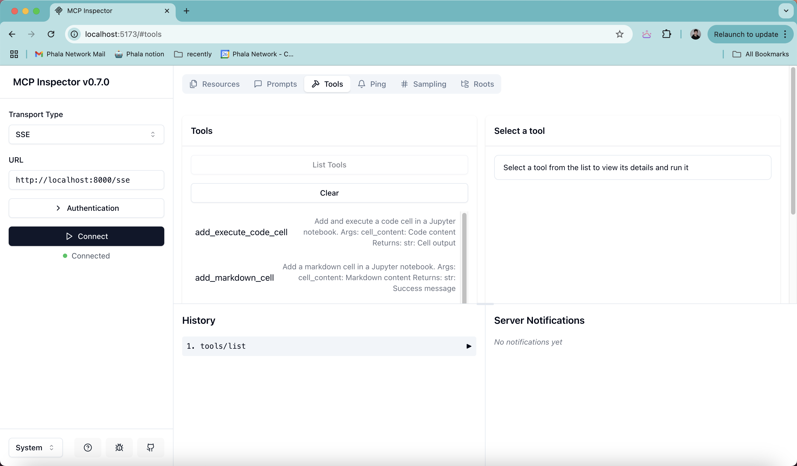
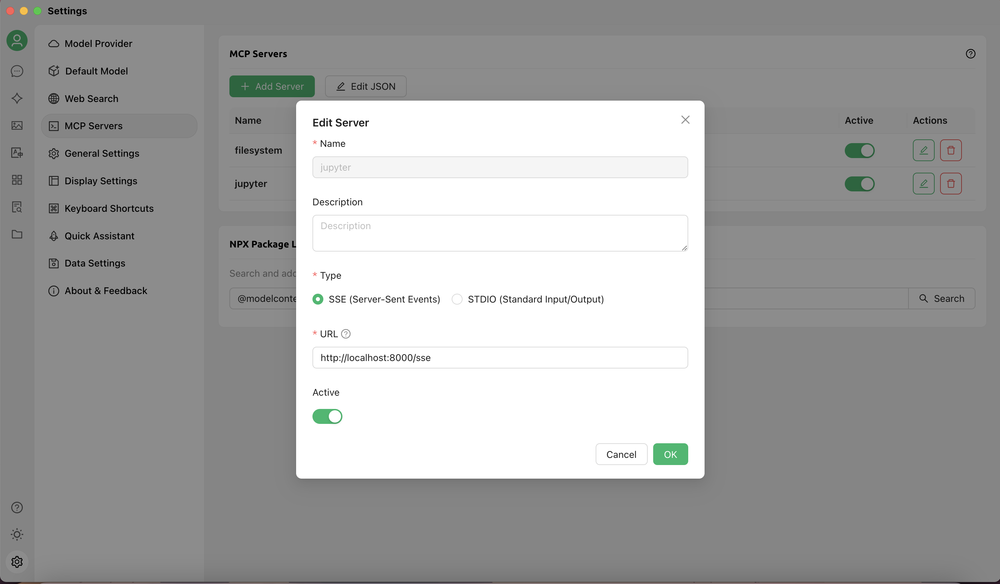
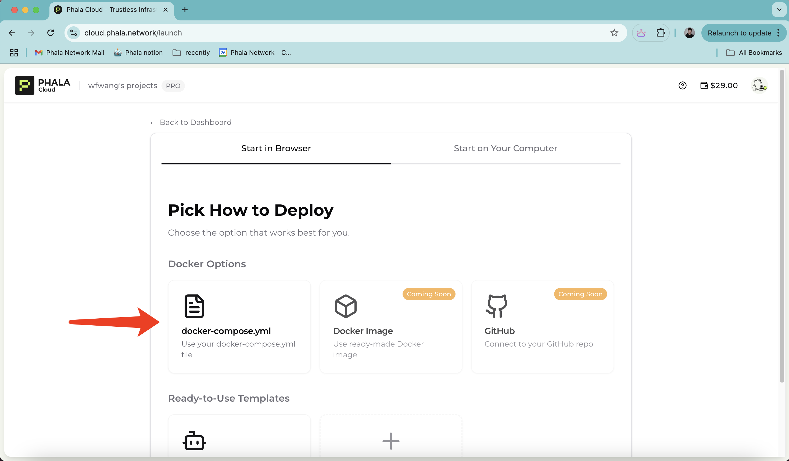
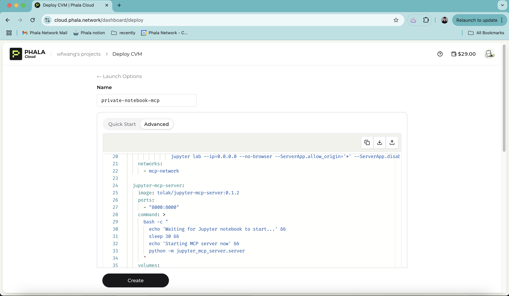
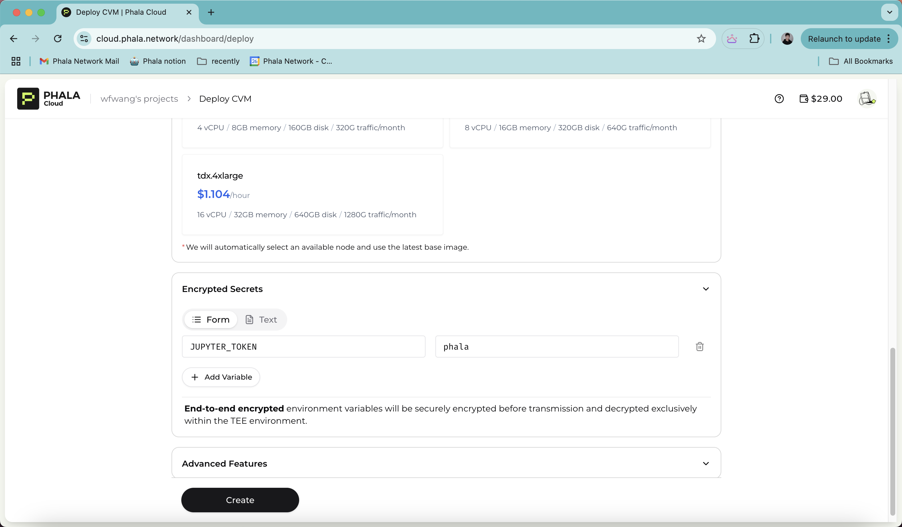
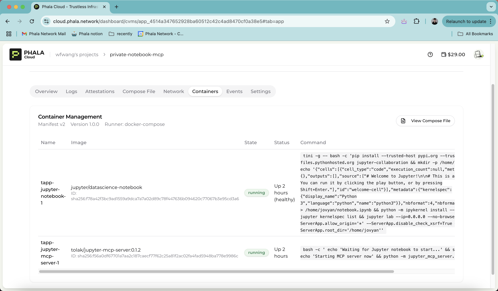
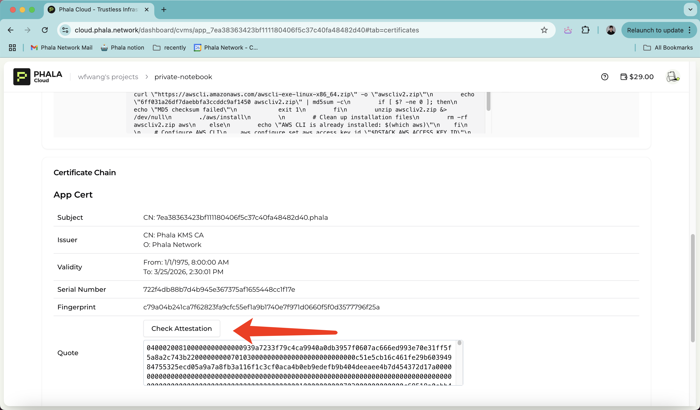

<div align="center">
  <a href="https://github.com/Phala-Network/phala-cloud-mcp-starter">
    <h1>Phala Cloud MCP Starter</h1>
  </a>
  <a href="https://cloud.phala.network/">
    
    <br />
  </a>
  <p align="center">
    This is a starter template for building a Jupyter Notebook remote MCP server on Phala Cloud. You can fork this repository to start your own MCP server.
    <br />
    <a href="https://phalanetwork.notion.site/Phala-Cloud-User-Guide-1700317e04a18018a98ed9ea39b02670"><strong>Explore Phala Cloud User Guide »</strong></a>
    <br />
    <br />
    <a href="https://github.com/Phala-Network/cloud-tee-starter-template/issues">Report Bug</a>
    ·
    <a href="https://t.me/+nbhjx1ADG9EyYmI9">Telegram</a>
    ·
    <a href="https://discord.gg/phala-network">Discord</a>
  </p>
</div>

## 📋 Prerequisites

- Fork the GitHub repository `phala-cloud-mcp-starter`
- Phala Cloud account ([Sign up with Redeem Code](https://cloud.phala.network/register?invite=WELCOME10))
- Docker Hub/Registry account, to push the built docker image to the registry

# Build remote MCP server on Phala Cloud

## Deploy your first MCP server

This guide will walk you through how to deploy a Jupyter Notebook remote MCP server to TEE with Phala Cloud. You will then customize this example to suit your needs.

> [MCP](https://www.anthropic.com/news/model-context-protocol) is an open standard that enables developers to build secure, two-way connections between their data sources and AI-powered tools.


The original Jupyter Notebook MCP server is implemented in [here](https://github.com/datalayer-inc/jupyter_mcp_server). We forked it to this repo and change the transport to `sse` to support the remote server. Now you can test locally and deploy the MCP server to Phala Cloud with the [docker compose](docker-compose.yml) file in this repo.

## Local development

### Run jupyter notebook MCP server locally

At the root of this repo, run the following command to start the jupyter notebook server and the MCP server.

```bash
docker compose up
```

the jupyter notebook server will be available at `http://localhost:8888` and the MCP server will be available at `http://localhost:8000` according to the setup in the [docker compose](docker-compose.yml) file. You will need to provide the token to access the jupyter notebook server, which is set to `phala` in the [docker compose](docker-compose.yml) file.

In a new terminal, run the [MCP inspector](https://github.com/modelcontextprotocol/inspector). The MCP inspector is an interactive MCP client that allows you to connect to jupyter notebook MCP server and invoke tools from a web browser.

```bash
npx @modelcontextprotocol/inspector@latest
```

Open the MCP inspector in your web browser:

```bash
http://localhost:5173
```

In the inspector, set **Transport Type** to `SSE` andenter the URL of jupyter notebook MCP server, http://localhost:8000/sse, and click **Connect**. Then in the **Tools** tab, you can see the tools provided by the jupyter notebook server.



### Interact with the MCP server

Note that the MPC server is running locally at `http://localhost:8000/sse`, so next we need to config the MCP client to connect to the MCP server. The screenshot below shows the config with [Cherry Studio](https://docs.cherry-ai.com/en-us).



Navigate to the chat page and you can type in your prompt to ask the client use the LLM to help you manage your notebook, for example we ask the LLM to draw a curve of sin(x) on the notebook.


For other MCP clients like using [Claude Desktop](https://claude.ai/download), you can use the following config by edit the config file.

> [mcp-remote](https://www.npmjs.com/package/mcp-remote) is a tool used to connect an MCP Client that only supports local (stdio) servers to a Remote MCP Server, with auth support.

```json
{
  "mcpServers": {
    "math": {
      "command": "npx",
      "args": [
        "mcp-remote",
        "http://localhost:8000/sse"
      ]
    }
  }
}
```

## Deploy to Phala Cloud

### Deploy the MCP server to Phala Cloud

You can follow this [tutorial](https://github.com/Phala-Network/phala-cloud-docs/blob/main/docs/deploy-to-phala-cloud.md) to deploy your MCP server to Phala Cloud. Here are general steps to deploy your MCP server to Phala Cloud:

1. On the [Phala Cloud](https://phala.network/cloud) dashboard, click **Deploy** and choose **Docker Compose** option for deployment.



2. Navigate to **Advanced** tab, copy this [docker compose](docker-compose.yml) file to the input box.



3. Choose a plan and set the environment variables **JUPYTER_TOKEN** in the **Secure Environment Variables** section, click **Create**.



4. Wait several minutes here because the VM will download the docker images, after you see the status become **Running** you can navigate to the **Containers** tab and you will see the Jupyter notebook container and the MCP server container are running.



### Configure the MCP client to connect to the remote MCP server

By navigating to the **Network** tab, you can find the **Public Enpoints** of the Juypter Notebook and the Juypter MCP server. You can configure a MCP client to connect to the Juypter MCP server with it's public endpoint.

```json
{
  "mcpServers": {
    "math": {
      "command": "npx",
      "args": [
        "mcp-remote",
        "https://7ea38363423bf111180406f5c37c40fa48482d40-8000.dstack-prod2.phala.network/sse"
      ]
    }
  }
}
```

### Verify the Attestation of the MCP server

Navigate to the **Attestation** tab, you can see the attestation of the your CVM. The attestation is a proof that the MCP server is running on the TEE. You can click the **Check Attestation** button to verify the attestation on the exploer.



Further more, you can generate the attestation of the MCP server inside the container, head to this [guide](https://docs.phala.network/phala-cloud/migration/generate-ra-report) for more details.

## Troubleshooting

1. MCP Inspector: `Error in /sse route: ReferenceError: fetch is not defined`

    This is because you are using an older version of node.js in your system. Please upgrade to a newer version.
